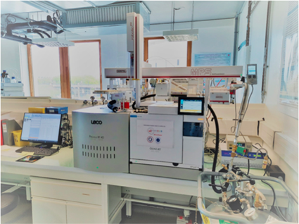

# Python-2DGC


<a name="readme-top"></a>

<!-- PROJECT LOGO -->
<br />
<div align="center">
  <a href="https://github.com/Easy47/Python-2DGC/">
    
  </a>

<h3 align="center">Python-2DGC</h3>

  <p align="center">
    Python GCxGC-MS data processing
    <br />
    <a href="https://github.com/Easy47/Python-2DGC/"><strong>« Explore the docs »</strong></a>
    <br />
    <br />
    <a href="https://github.com/Easy47/Python-2DGC/">View Demo</a>
    ·
    <a href="https://github.com/Easy47/Python-2DGC/issues">Report Bug</a>
    ·
    <a href="https://github.com/Easy47/Python-2DGC/issues">Request Feature</a>
  </p>
</div>


<!-- TABLE OF CONTENTS -->
<details>
  <summary>Table of Contents</summary>
  <ol>
    <li>
      <a href="#about-the-project">About The Project</a>
      <ul>
        <li><a href="#built-with">Built With</a></li>
      </ul>
    </li>
    <li>
      <a href="#getting-started">Getting Started</a>
      <ul>
        <li><a href="#prerequisites">Prerequisites</a></li>
        <li><a href="#installation">Installation</a></li>
      </ul>
    </li>
    <li><a href="#usage">Usage</a></li>
    <li><a href="#license">License</a></li>
    <li><a href="#contact">Contact</a></li>
  </ol>
</details>


<!-- ABOUT THE PROJECT -->
## About The Project

Python package to process GCxGC-MS data.

* Processing and annotation of chromatograms
* Chromatogram visualization
* Peak tables alignment and chromatogram alignment using R package
* Machine learning and statistical analysis for the automatic detection of biomarkers
* Pixel discriminant approach for the automatic detection of biomarkers
* GCxGC-MS data simulation


<p align="right">(<a href="#readme-top">back to top</a>)</p>


### Built With

* [][Python-url]
* [][Jupyter-url]
* [][R-url]


<p align="right">(<a href="#readme-top">back to top</a>)</p>


<!-- GETTING STARTED -->
## Getting Started

This is an example of how to use the package.

### Prerequisites

* Python
* Rscript
* Set NIST database location in **matching_nist_lib_from_chromato_cube()** in **matching.py**
  * Update the path to the NIST database location by setting the **lib_path** argument line 53
  * Set the **work_dir** line 55

### Installation

1. Clone the repo
   ```sh
   git clone git@github.com:Easy47/Python-2DGC.git
   ```
2. Install Python packages
   ```sh
   pip install -r requirements.txt
   ```
3. R package for alignment R2DGC and RGCxGC.
#### If you need to simulate data
1. Generate lib scores
    ```sh
    cd src
    python generate_lib_scores.py
    ```
1.  **(Optional)** Copy of the hmdb library with NIST Casno in spectra metadata **(the file is already in src folder)**. If you need to recreate the file use the function **generate_lib_scores_from_lib()** in **utils.py**.
    ```python
    import utils
    utils.generate_lib_scores_from_lib("lib_filename", "output_filename")
    ```

<p align="right">(<a href="#readme-top">back to top</a>)</p>


<!-- USAGE EXAMPLES -->
## Usage

1. **Processes cohort chromatograms, generates peak tables and performs alignment.**
    ```sh
    cd src
    #PATH_TO_THE_COHORT: Path to the folder containing chromatograms of the cohort.
    # OUTPUT_PATH: Directory where peak tables and aligned peak table will be generated.
    # READ detailed documentation in identification_main.py for more parameters.
    python identification_main.py -p PATH_TO_THE_COHORT -op OUTPUT_PATH
    ```

_For more examples, please refer to the [Documentation](https://github.com/Easy47/Python-2DGC/blob/main/docs/DOCUMENTATION.md)_ for an **overview of the functions**, read the **detailed documentation of a specific function directly in its file** or read **example notebooks in notebooks folder**.

<p align="right">(<a href="#readme-top">back to top</a>)</p>


<!-- LICENSE -->
## License

See `LICENSE.txt` for more information.

<p align="right">(<a href="#readme-top">back to top</a>)</p>


<!-- CONTACT -->
## Contact

* [Camille Roquencourt](mailto:camille.roquencourt@hotmail.fr)

* [Nicolas Romano](mailto:nicolas.romano@epita.fr)

Project Link: [https://github.com/Easy47/Python-2DGC](https://github.com/Easy47/Python-2DGC)

<p align="right">(<a href="#readme-top">back to top</a>)</p>


<!-- MARKDOWN LINKS & IMAGES -->
<!-- https://www.markdownguide.org/basic-syntax/#reference-style-links -->
[contributors-shield]: https://img.shields.io/github/contributors/github_username/repo_name.svg?style=for-the-badge
[contributors-url]: https://github.com/github_username/repo_name/graphs/contributors
[forks-shield]: https://img.shields.io/github/forks/github_username/repo_name.svg?style=for-the-badge
[forks-url]: https://github.com/github_username/repo_name/network/members
[stars-shield]: https://img.shields.io/github/stars/github_username/repo_name.svg?style=for-the-badge
[stars-url]: https://github.com/github_username/repo_name/stargazers
[issues-shield]: https://img.shields.io/github/issues/github_username/repo_name.svg?style=for-the-badge
[issues-url]: https://github.com/github_username/repo_name/issues
[license-shield]: https://img.shields.io/github/license/github_username/repo_name.svg?style=for-the-badge
[license-url]: https://github.com/github_username/repo_name/blob/master/LICENSE.txt
[linkedin-shield]: https://img.shields.io/badge/-LinkedIn-black.svg?style=for-the-badge&logo=linkedin&colorB=555
[linkedin-url]: https://linkedin.com/in/linkedin_username
[product-screenshot]: images/screenshot.png
[Next.js]: https://img.shields.io/badge/next.js-000000?style=for-the-badge&logo=nextdotjs&logoColor=white

[Python-url]: https://python.org/
[Jupyter-url]: https://jupyter.org/
[R-url]: https://www.r-project.org/
